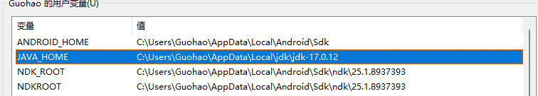
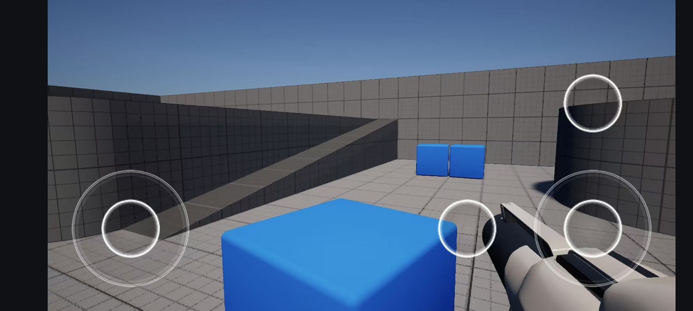

# 课程作业：

# 作业1：

1.源码编译UE5，新建一个C++工程，进行简单场景编辑和工程设置

2.编译并构建安装包，确保能够用来将游戏工程安装到手机正常运行

（若无Andorid手机可构建桌面版本）

---

通过参考猫猫头的方案：[【UE5.4】猫猫都能看懂的Android打包新版攻略_ue5.4安卓打包-CSDN博客](https://blog.csdn.net/qq_35587645/article/details/139207695?ops_request_misc=%257B%2522request%255Fid%2522%253A%252213f09d467a71344b77971482a2b65897%2522%252C%2522scm%2522%253A%252220140713.130102334..%2522%257D&request_id=13f09d467a71344b77971482a2b65897&biz_id=0&utm_medium=distribute.pc_search_result.none-task-blog-2~all~sobaiduend~default-1-139207695-null-null.142^v100^pc_search_result_base2&utm_term=%E7%8C%AB%E7%8C%AB%E9%83%BD%E8%83%BD%E7%9C%8B%E6%87%82%E7%9A%84&spm=1018.2226.3001.4187)

其中核心问题点在于：

- 重新配置jdk的版本，从网站上下载获得最新的`jdk17` 版本，替换到环境变量中

```html
https://download.oracle.com/java/17/archive/jdk-17.0.12_windows-x64_bin.zip
```



- 多半是由于网络原因，下图文件下载不下来，将其手动下载后将位置放到以下路径中`C:\Users\Guohao\.gradle\wrapper\dists\gradle-7.5-all\6qsw290k5lz422uaf8jf6m7co`


作业完成内容展示：



